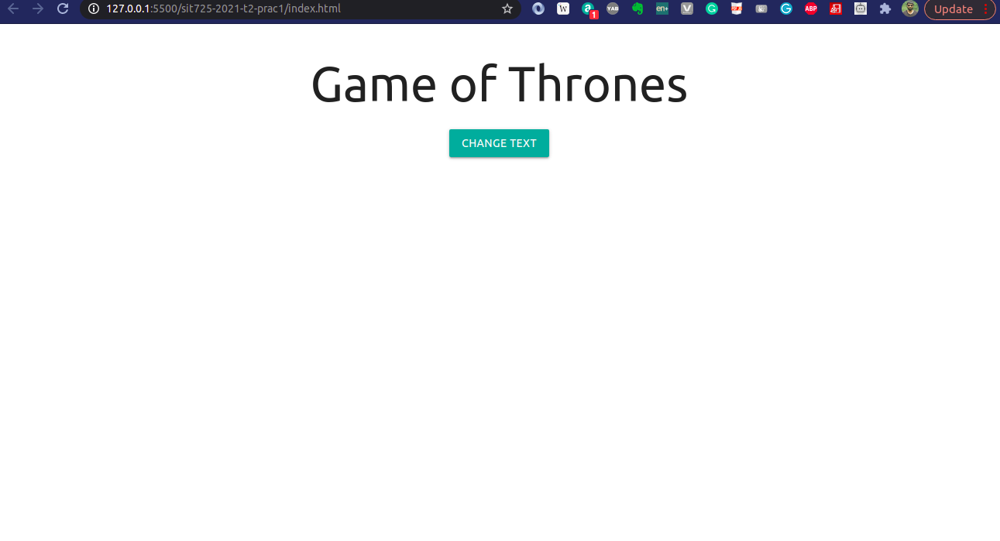

# SIT725 Applied Software Engineering Prac 1

Unit Chair - Dr. Alessio Bonti

In this practical, we learnt how to create and manage repositories on github and push one simple repository consisting of a web application.

## Stack

## Run the application
Open the code in  and install the `Live Server` extension  and you should be able to host the application by hitting `Go Live`

## Output

## License

## Questions?

You can reach out to me at  or follow me on 